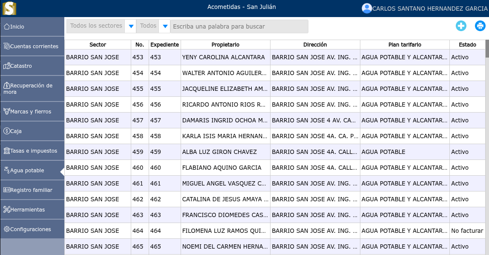
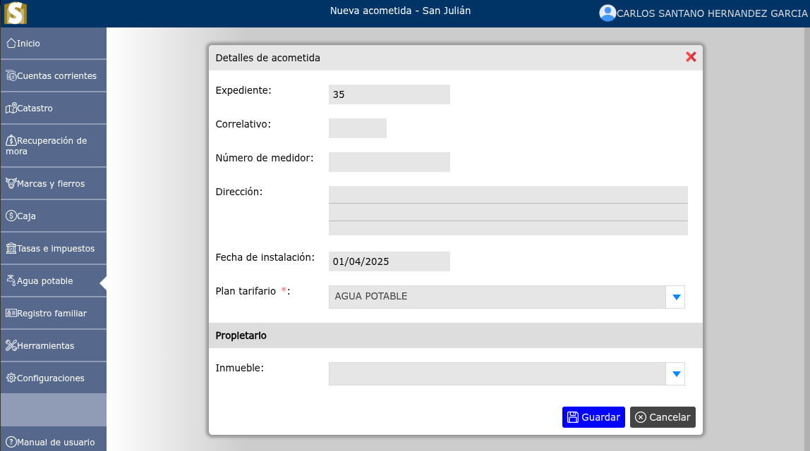
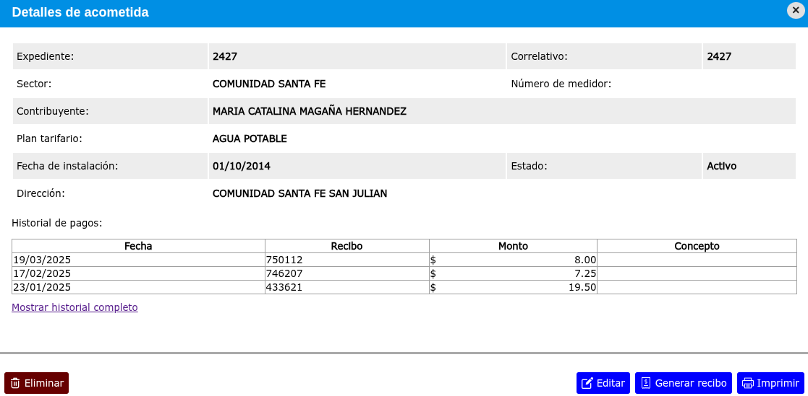

# Acometidas

La acometida de agua es el conjunto de elementos y conexiones que permiten la transferencia del agua desde la red hidráulica pública hasta el sistema interno de una propiedad.

---

## Lista de acometidas

Para ver la lista de acometidas, vaya a: **Agua potable > Acometidas**.

Se mostrará un selector en donde podrá filtrar cada sector y de igual forma se podrá observar un selector para filtrar cuales acometidas siguen en estado activo, suspendido, suspendido por mora o no facturar.

---

## Registrar nueva acometida

Para registrar una nueva acometida, vaya a: **Agua potable > Acometidas**, y luego dar clic en el botón **+**.

---

## Modificar acometida

Para modificar una acometida, vaya a: **Agua potable > Acometidas**, luego dar clic en el nombre de la acometida que desea modificar y se mostrará una vista en donde podrá observar la opción **Editar**.

---

## Eliminar acometida

Para eliminar una acometida, vaya a: **Agua potable > Acometidas**, luego dar clic en el nombre de la acometida que desea eliminar y se mostrará una vista en donde podrá observar la opción **Eliminar**.

