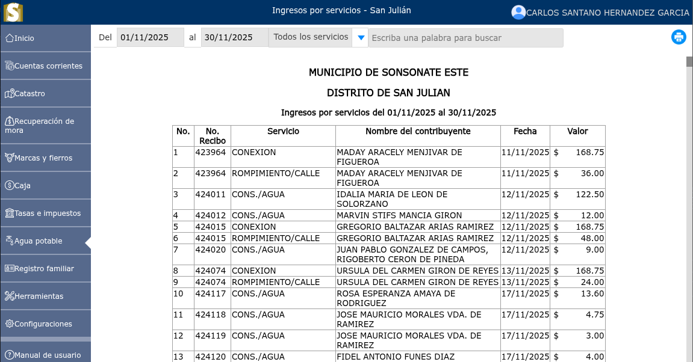

# Ingresos por servicios

Los ingresos por servicios son el dinero que recibe una empresa o profesional por realizar actividades intangibles a los usuarios.

---

## Listado de ingresos por servicios

Para ver el listado de ingresos por servicios, vaya a: **Agua potable > Ingresos por servicios**.

