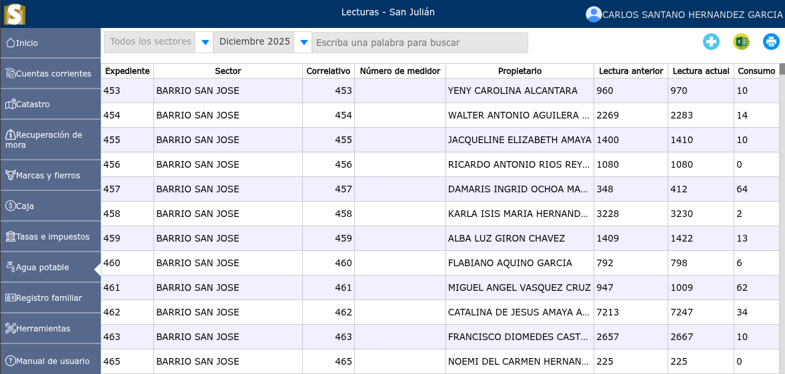
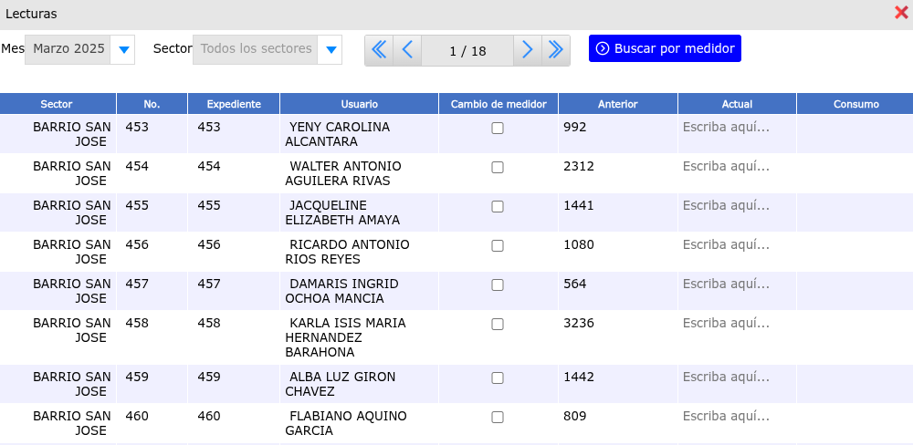
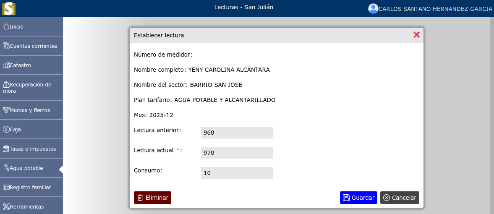

# Lecturas

Es un proceso mensual, que determina y valida el consumo efectivo de un medidor, en forma oportuna y confiable, cumpliendo con la normativa vigente, como para el correcto desempeño de los procesos de facturación y gestión de pérdidas.

---

## Listado de lecturas

Para ver el listado de lecturas, vaya a: **Agua potable > Lecturas**.

Se mostrará un selector en el cual podrá seleccionar los sectores y el mes.

---

## Registro de nuevas lecturas

Para registrar nuevas lecturas, vaya a: **Agua potable > Lecturas**, y luego dar clic en el botón **+**.

Se mostrará un selector en el cual deberá seleccionar el mes de el que se van a generar las lecturas y a la vez ir seleccionando cada uno de los sectores. Al terminar de llenar las lecturas de un sector dar clic en **guardar**.

---

## Modificación de una lectura

Para modificar una lectura, vaya a: **Agua potable > Lecturas**, luego dar clic en el nombre de la lectura que desea modificar y luego de haber modificado la lectura dar clic en el botón **Guardar**.

---

## Eliminar lectura

Para eliminar una lectura, vaya a: **Agua potable > Lecturas**, luego dar clic en el nombre de la lectura que desea eliminar y se mostrará un formulario en donde podrá observar la opción **Eliminar**.

