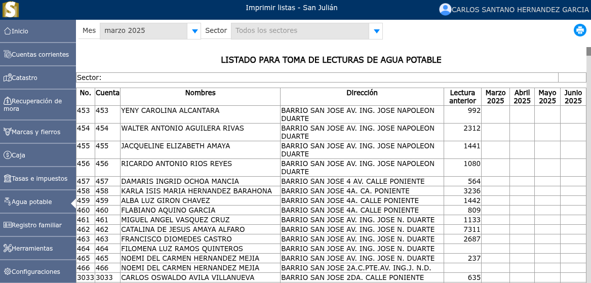

# Listas

Listado de todos los sectores que se imprime para la toma de lecturas.

---

## Listado para toma de lecturas

Para ver el listado de toma de lecturas, vaya a: **Agua potable > Listas**.

Se mostrará un selector en el cual podrá seleccionar el mes de las respectivas tomas de lecturas, de igual forma se mostrará un selector en donde deberá ir seleccionando cada sector y dar clic en el botón **Generar lista**, luego de haber generado la lista podrá ir al ícono **imprimir**.

