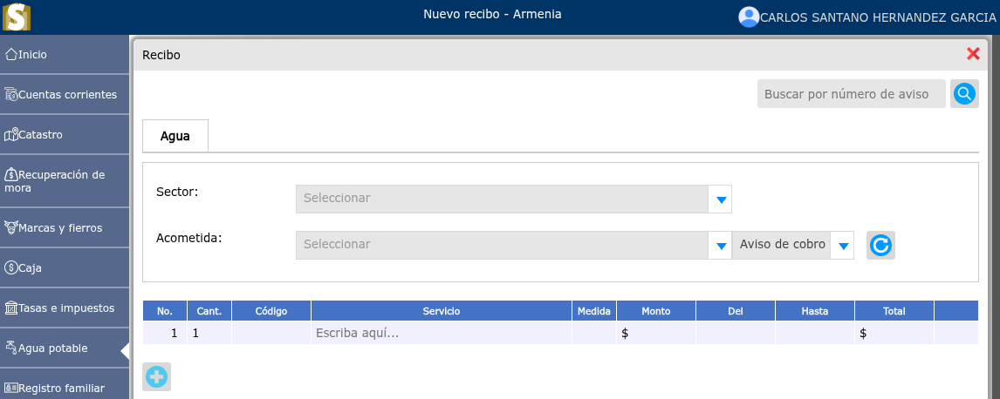
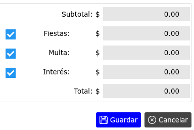
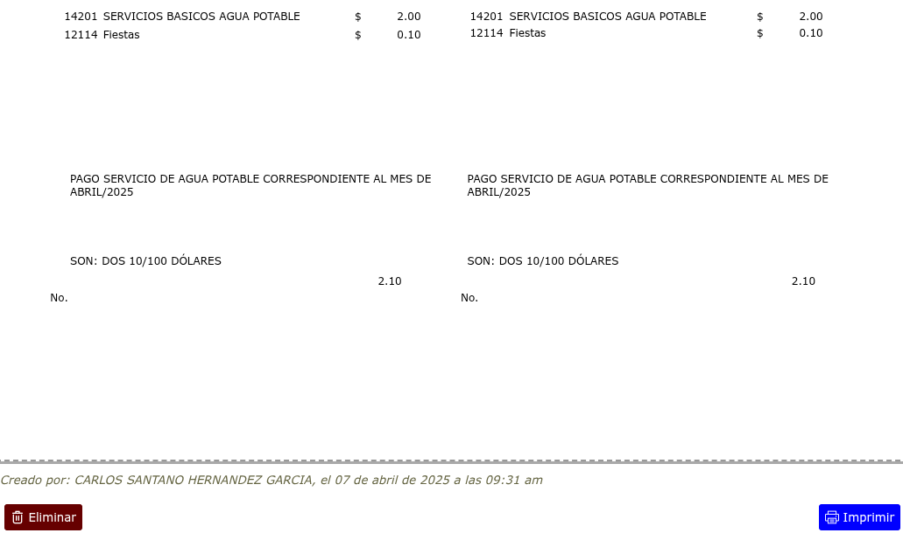

# recibo de agua

Generación de recibos de agua potable.

---

## Generación de nuevo recibo

Para generar un nuevo recibo, vaya a: **Agua potable > Nuevo recibo**.

---

## Activación y desactivación de fiestas

Para activar o desactivar fiestas, dar clic en la casilla de verificación junto al ítem correspondiente.

---

## Imprimir recibo

Para imprimir un recibo luego de que se ha hecho el proceso de generación se mostrará una vista en donde se podrá observar la opción **Imprimir**. Al momento de dar clic en la opción **Imprimir** se genera el correlativo.

