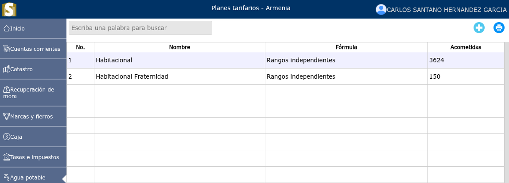
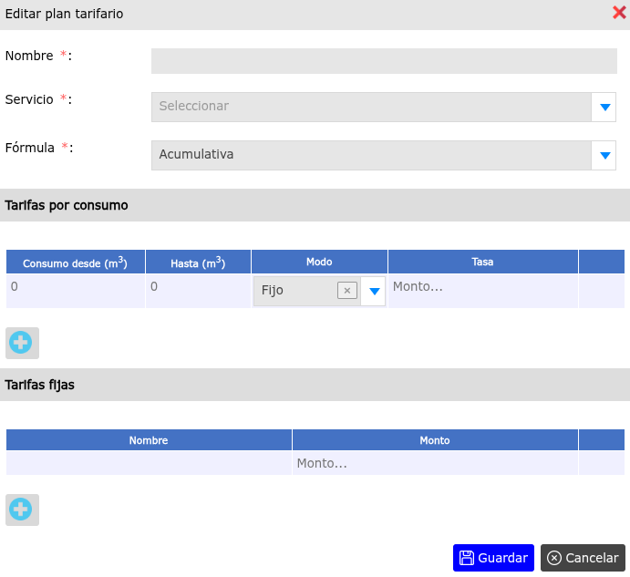
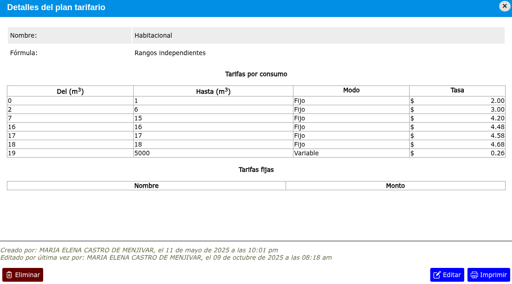

# Planes tarifarios

Un plan tarifario es la forma en como se calcula el cobro por consumo de agua potable pudiéndosele adicionar cargos fijos.

---

## Lista de planes tarifarios

Para ver la lista de planes tarifarios, vaya a: **Agua potable > Planes tarifarios**.

---

## Registrar nuevo plan tarifario

Para registrar un nuevo plan tarifario, vaya a: **Agua potable > Planes tarifarios**, y luego dar clic en el botón **+**.

---

## Modificar plan tarifario

Para modificar un plan tarifario, vaya a: **Agua potable > Planes tarifarios**, luego dar clic en el nombre de el plan tarifario que desea modificar y se mostrará una vista en donde podrá observar la opción **Editar**.

---

## Eliminar plan tarifario

Para eliminar un plan tarifario, vaya a: **Agua potable > Planes tarifarios**, luego dar clic en el nombre de el plan tarifario que desea eliminar y se mostrará una vista en donde podrá observar la opción **Eliminar**.

