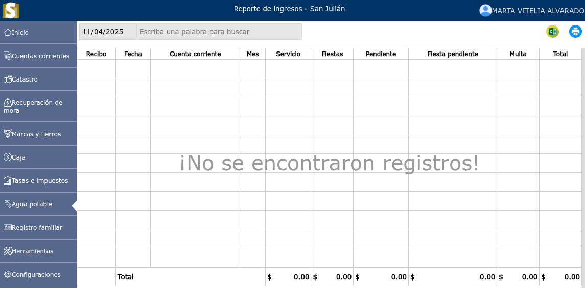

# Reporte de ingresos

La presentación de informes de ingresos es el proceso de documentar y analizar los ingresos que una entidad genera a partir de sus actividades comerciales normales.

---

## Listado de reporte de ingresos

Para ver el listado de reporte de ingresos, vaya a: **Agua potable > Reporte de ingresos**.

