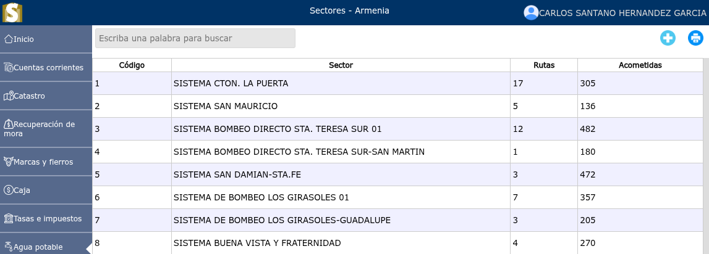
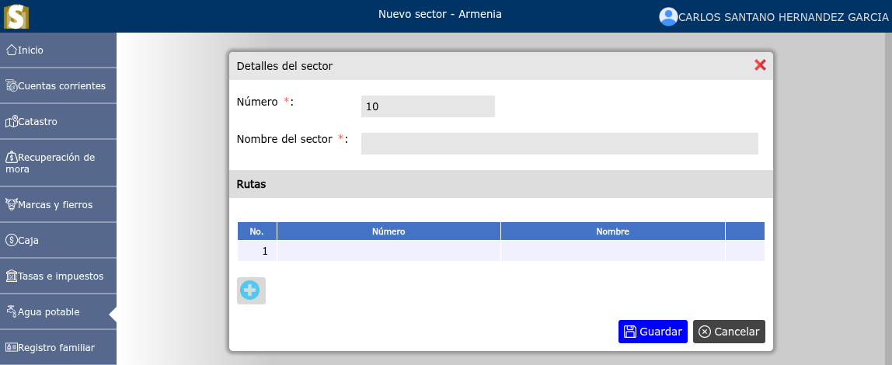
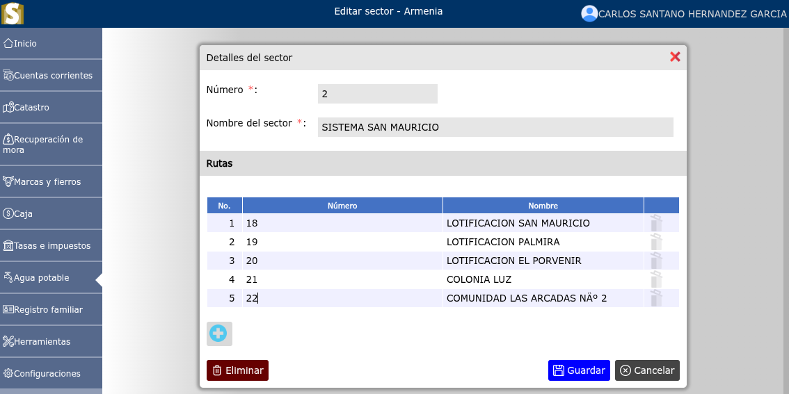

# Sectores

Lista de sectores.

---

## Lista de sectores

Para ver la lista de sectores, vaya a: **Agua potable > Sectores**.

---

## Registrar nuevo sector

Para registrar un nuevo sector, vaya a: **Agua potable > Sectores**, y luego dar clic en el botón **+**.

---

## Modificar sector

Para modificar un sector, vaya a: **Agua potable > Sectores**, luego dar clic en el nombre de el sector que desea modificar y luego de haber modificado el sector dar clic en el botón **Guardar**.

---

## Eliminar sector

Para eliminar un sector, vaya a: **Agua potable > Sectores**, luego dar clic en el nombre de el sector que desea eliminar y podrá observar la opción **Eliminar**.

