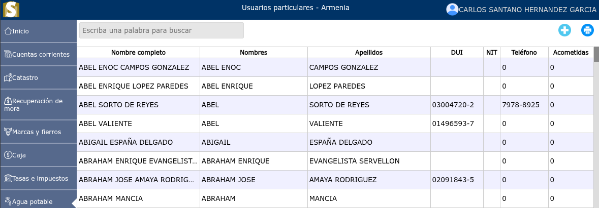
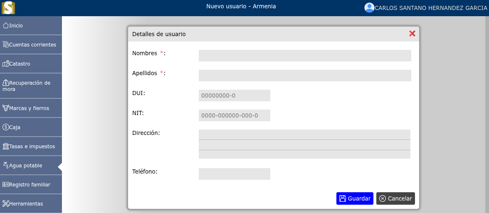
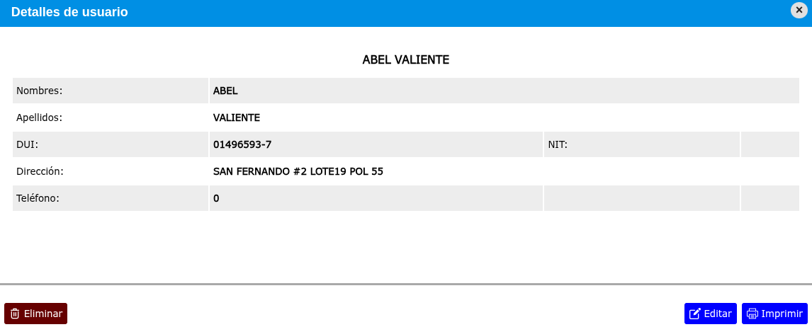

# Usuarios particulares

Lista de usuarios particulares.

---

## Listado de usuarios particulares

Para ver el listado de usuarios particulares, vaya a: **Agua potable > Usuarios particulares**.

---

## Crear usuario particular

Para crear un usuario particular, vaya a: **Agua potable > Usuarios particulares**, luego dar clic en el botón **+**.

---

## Modificar usuario particular

Para modificar un usuario particular, vaya a: **Agua potable > Usuarios particulares**, luego dar clic en el nombre de el usuario particular que desea modificar y se mostrará una vista en donde podrá observar la opción **Editar**.

---

## Eliminar usuario particular

Para eliminar un usuario particular, vaya a: **Agua potable > Usuarios particulares**, luego dar clic en el nombre de el usuario particular que desea eliminar y se mostrará una vista en donde podrá observar la opción **Eliminar**.

