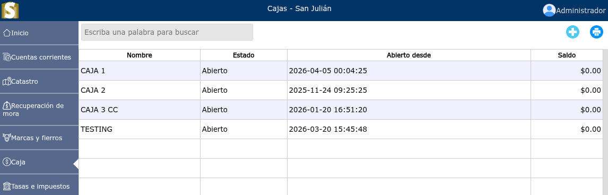
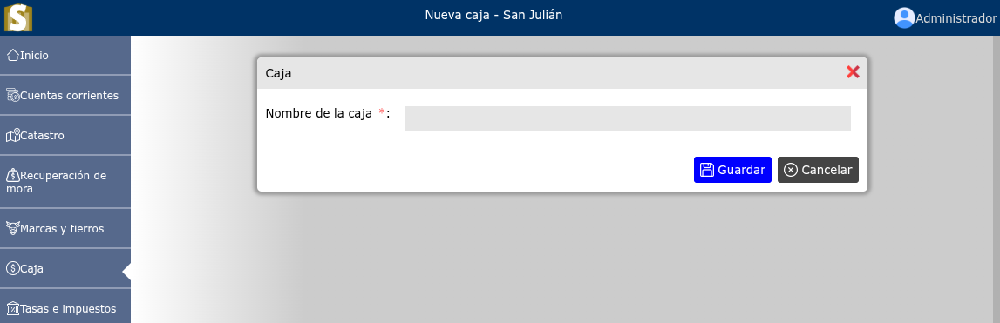
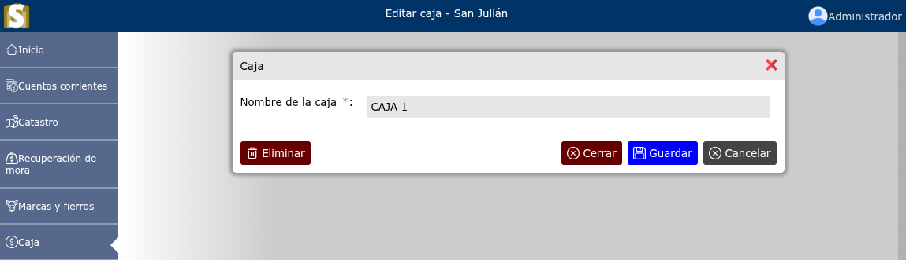

# Cajas

Lista de cajas.

---

## Lista de cajas

Para ver la lista de cajas, vaya a: **Caja > Cajas**.

---

## Registrar una nueva caja

Para registrar una nueva caja, vaya a: **Caja > Cajas**, y luego dar clic en el botón **+**.

## Cerrar caja

Para cerrar una caja, vaya a: **Caja > Cajas**, luego dar clic en el nombre de la caja que desea cerrar, y se podrá observar la opción de **Cerrar**.

## Eliminar caja

Para eliminar una caja, vaya a: **Caja > Cajas**, luego dar clic en el nombre de la caja que desea eliminar, y se podrá observar la opción de **Eliminar**.

