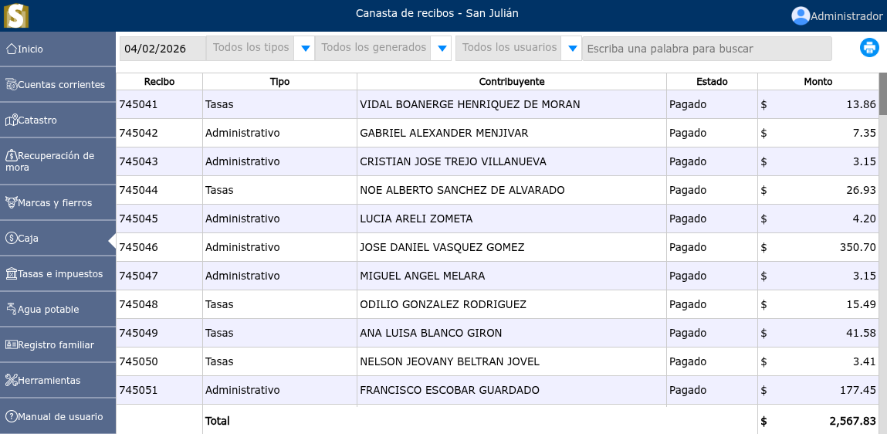

# Canasta de recibos

Lista de recibos generados de tasas e impuestos.

---

## Lista de recibos generados desde el módulo de canasta de recibos

Para ver la lista de recibos generados, desde la canasta de recibos, vaya a: **Caja > Canasta de recibos**, en donde podrá observar las opciones de filtrar todos los tipos de recibos por fechas, todos los generados ya sea emitidos, pagados o anulados y filtrar cuales recibos fueron generados por cada uno de los usuarios.

---
