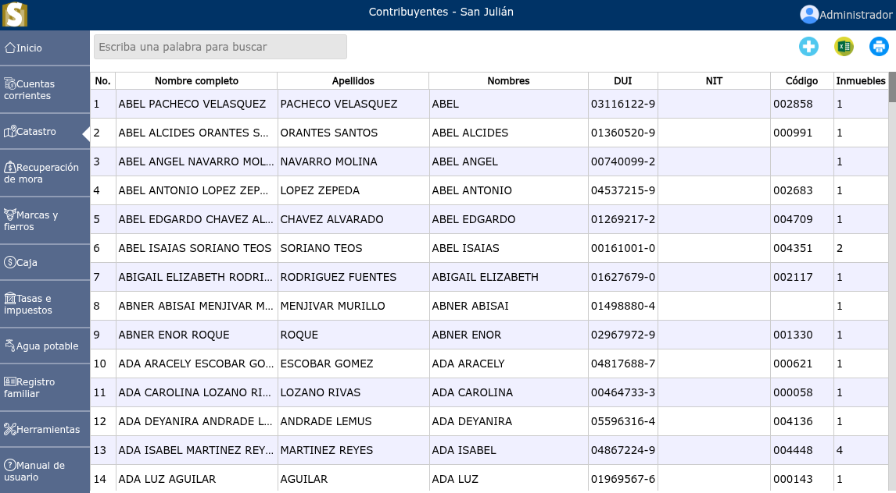
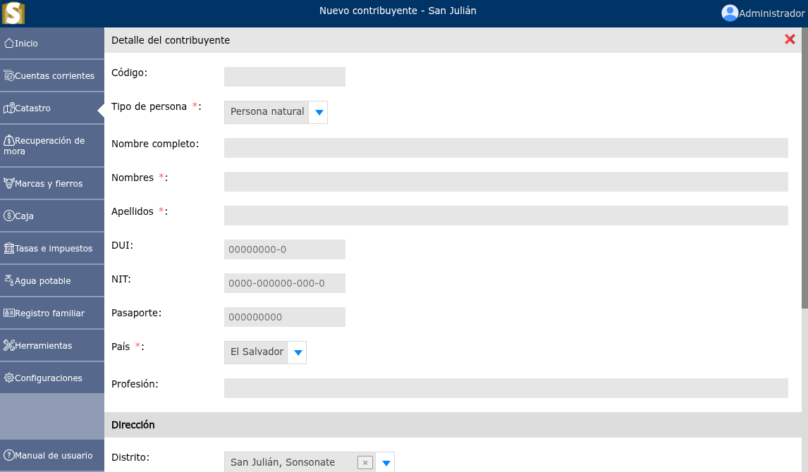
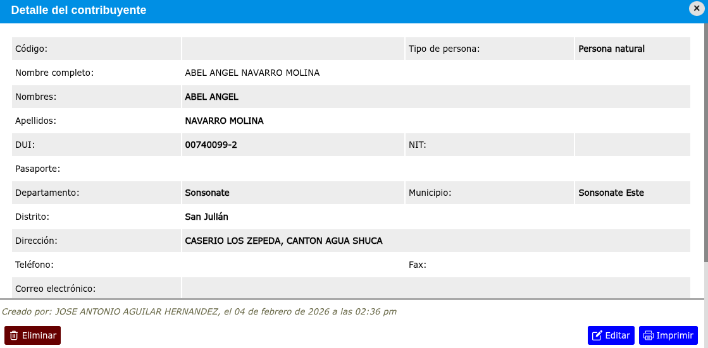

# Contribuyentes

Lista de contribuyentes registrados.

---

## Lista de contribuyentes

Para ver la lista de contribuyentes, desde el menú principal vaya a: **Catastro > Contribuyentes.**

---

## Registrar un nuevo contribuyente

Para registrar un nuevo contribuyente, vaya a: **Catastro > Contribuyentes**, y luego dar clic en el botón **+**.

---

## Modificar un contribuyente

Para modificar un contribuyente, vaya a: **Catastro > Contribuyentes**, luego dar clic en el contribuyente que desea modificar, se mostrará una vista en donde se podrá observar la opción **Editar**.

---

## Eliminar un contribuyente

Para eliminar un contribuyente, vaya a: **Catastro > Contribuyentes**, luego dar clic en el contribuyente que desea eliminar, se mostrará una vista en donde se podrá observar la opción **Eliminar**.

