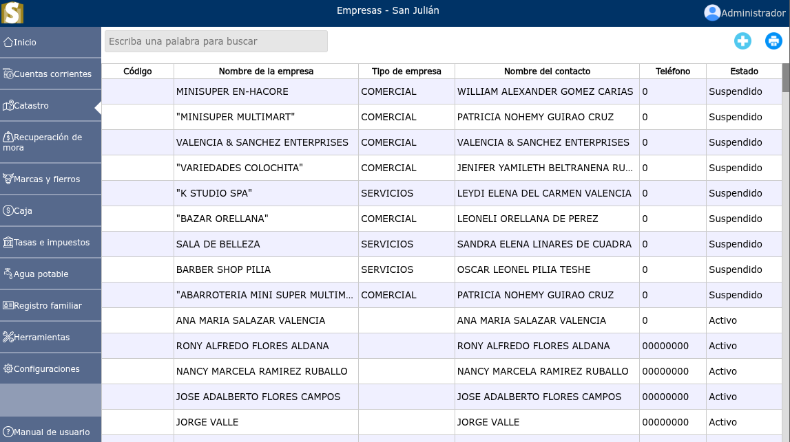
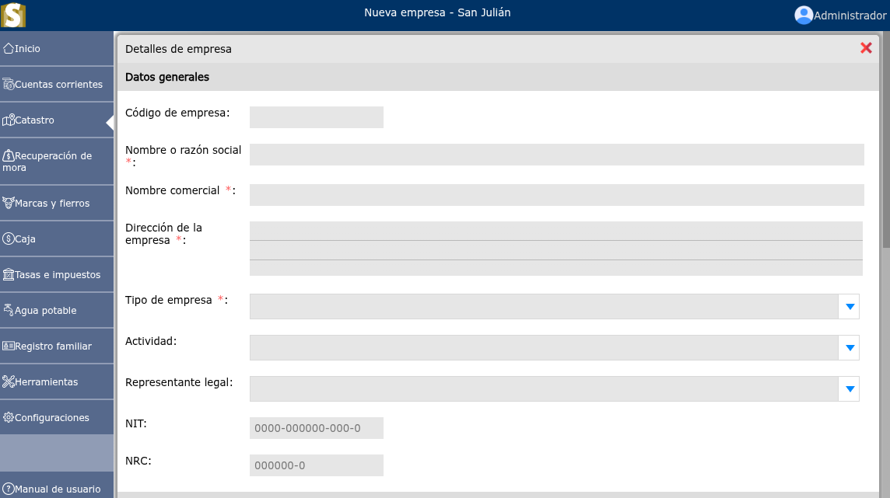
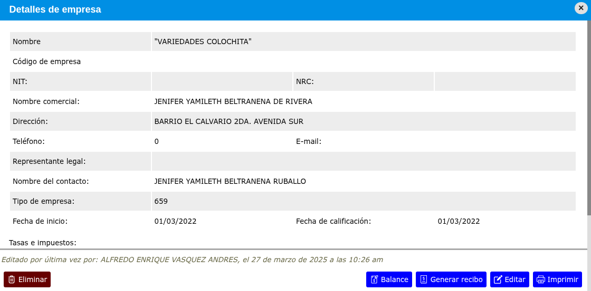
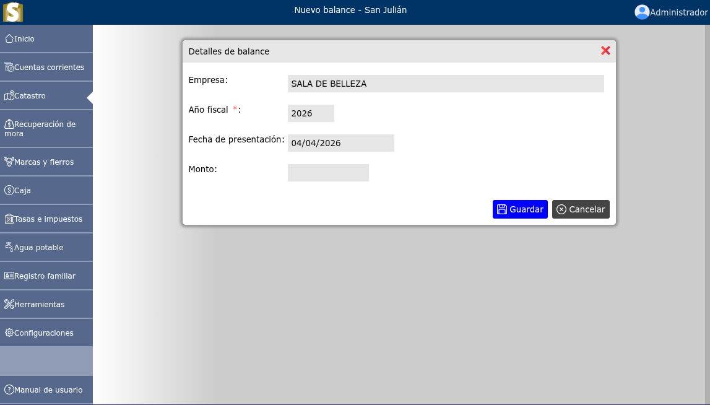
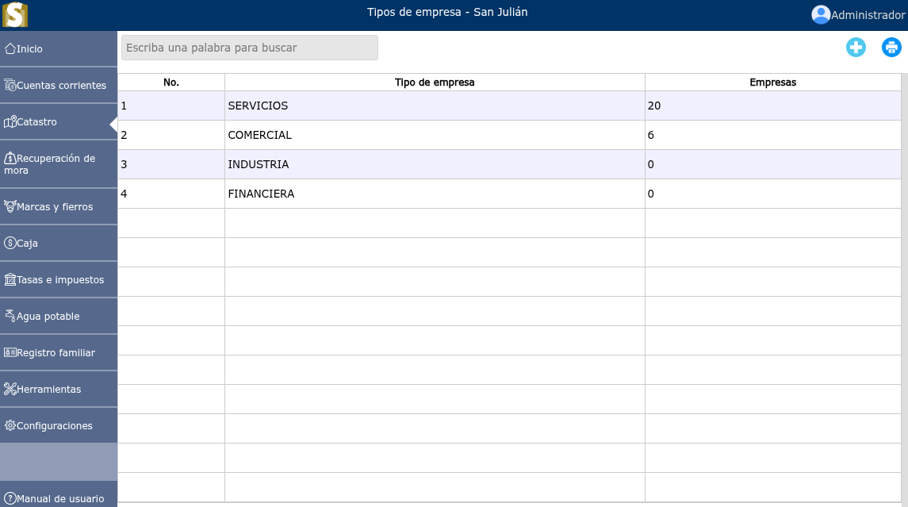
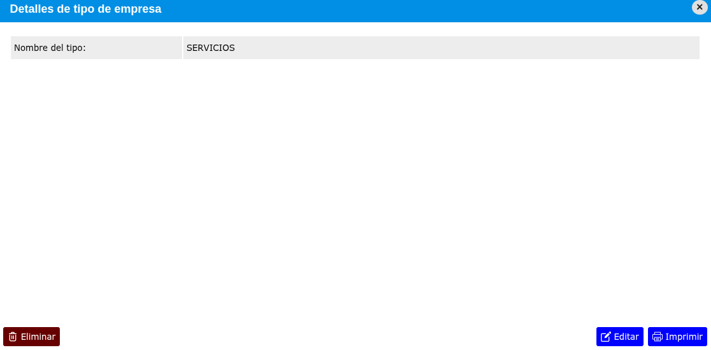

# Empresas

Una empresa es una unidad económica y social, compuesta por capital y recursos humanos.

---

## Lista de empresas

Para ver la lista de empresas registradas, vaya a: **Catastro > Empresas**.

---

## Registrar una nueva empresa

Para registrar una nueva empresa, vaya a: **Catastro > Empresas**, y luego dar clic al botón **+**.

---

## Modificar una empresa

Para modificar una empresa, vaya a: **Catastro > Empresas**, luego dar clic en el nombre de la empresa que desea modificar y se mostrará una vista en donde se podrá observar la opción de **Editar**.

---

## Registrar balance anual

Para registrar el balance anual de una empresa, vaya a: **Catastro > Empresas**, luego dar clic en el nombre de la empresa que desea registrar el balance anual y se mostrará una vista en donde se podrá observar la opción de **Balance**.

---

## Eliminar una empresa

Para eliminar una empresa, vaya a: **Catastro > Empresas**, luego dar clic en el nombre de la empresa que desea eliminar y se mostrará una vista en donde se podrá observar la opción de **Eliminar**.

---

## Lista de tipos de empresa

Para ver la lista de tipos de empresas, vaya a: **Catastro > Tipos de empresa**. Y para registrar un nuevo tipo de empresa dar clic en el botón **+**.

---

## Modificar un tipo de empresa

Para modificar un tipo de empresa, vaya a: **Catastro > Tipos de empresa**, luego dar clic en el nombre del tipo de empresa que desea modificar y se mostrará una vista en donde se podrá observar la opción de **Editar**.

---

## Eliminar un tipo de empresa

Para eliminar un tipo de empresa, vaya a: **Catastro > Tipos de empresa**, luego dar clic en el nombre del tipo de empresa que desea eliminar y se mostrará una vista en donde se podrá observar la opción de **Eliminar**.

