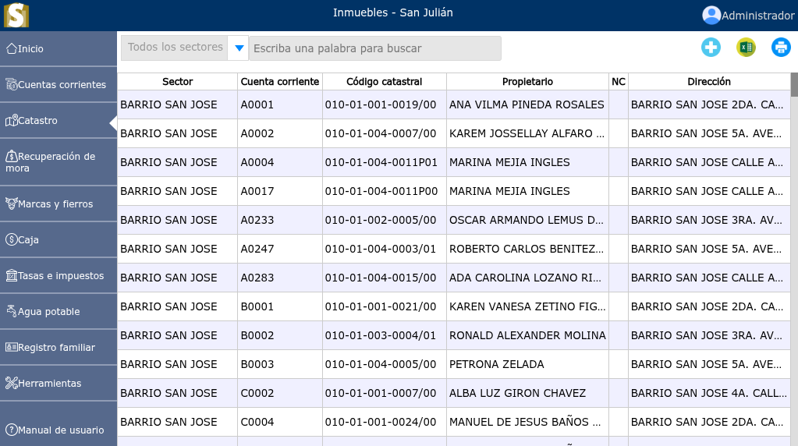
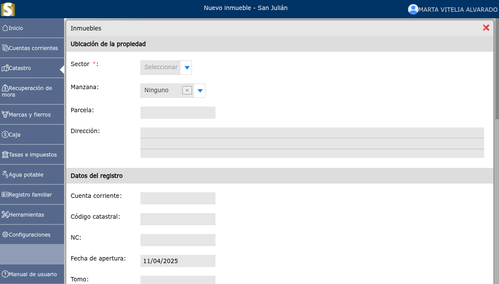
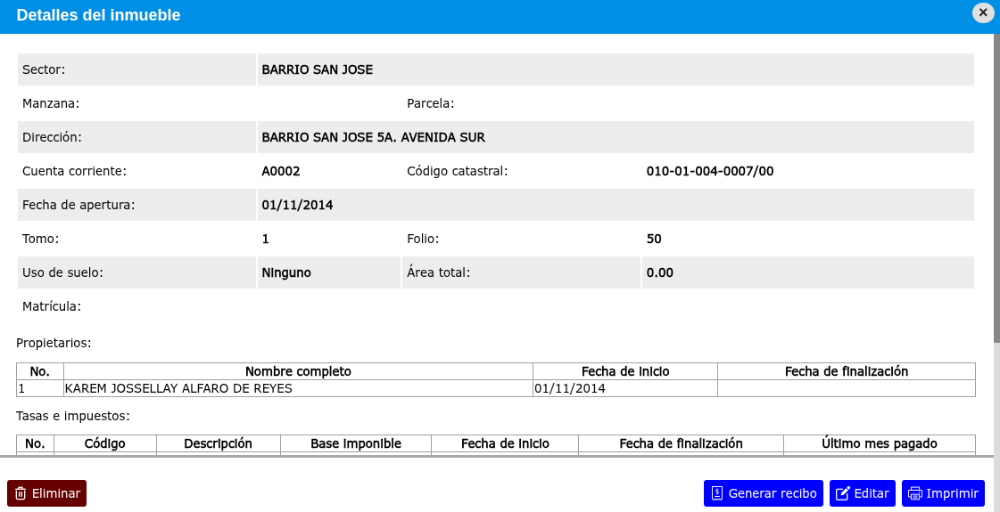

# Inmuebles

Un bien inmueble o bien raíz es una propiedad con ubicación fija que no puede trasladarse sin alterar su estructura.

---

## Lista de inmuebles

Para ver la lista de inmuebles, vaya a: **Catastro/Inmuebles**. En la parte izquierda de arriba se mostrará un selector en donde podrá seleccionar un sector en específico.

---

## Registrar un nuevo inmueble

Para registrar un nuevo inmueble, vaya a: **Catastro/Inmuebles**, luego dar clic en el botón **+**.

---

## Modificar un inmueble

Para modificar un inmueble, vaya a: **Catastro/Inmuebles**, luego dar clic en el Inmueble que desea modificar, se mostrará una vista en donde se podrá observar la opción **Editar**.

---

## Eliminar un inmueble

Para eliminar un inmueble, vaya a: **Catastro/Inmuebles**, luego dar clic en el Inmueble que desea eliminar, se mostrará una vista en donde se podrá observar la opción **Eliminar**.

