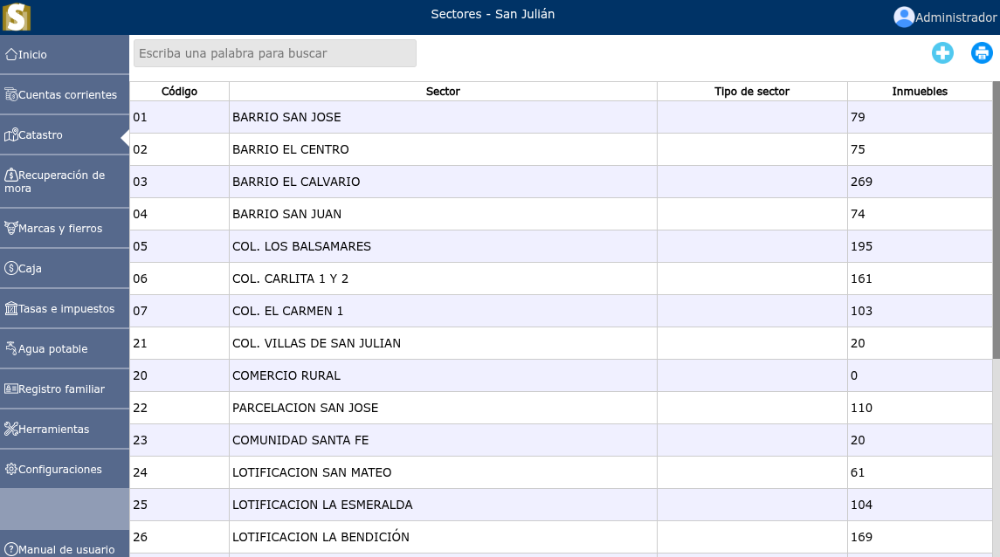
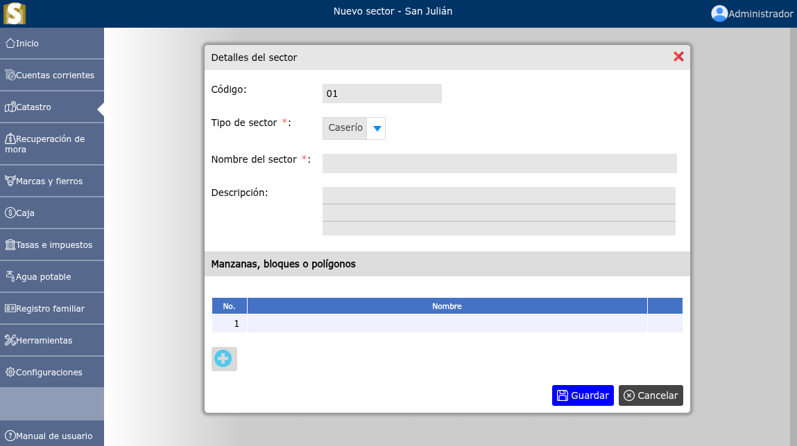

# Sectores

Lista de sectores.

---

## Lista de sectores

Para ver la lista de sectores, vaya a: **Catastro > Sectores**.

---

## Registrar un nuevo sector

Para registrar un nuevo sector, vaya a: **Catastro > Sectores**, y luego dar clic en el botón **+**.

---

## Modificar un sector

Para modificar un sector, vaya a: **Catastro > Sectores**, luego dar clic en el nombre de el sector que desea modificar y se podrá observar la opción **Editar**.

---

## Eliminar un sector

Para eliminar un sector, vaya a: **Catastro > Sectores**, luego dar clic en el nombre de el sector que desea eliminar y se podrá observar la opción **Eliminar**.