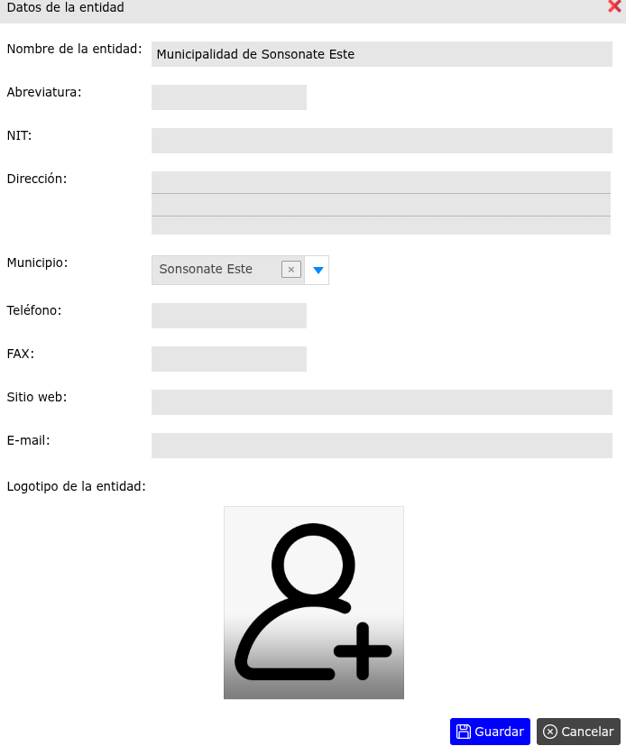

# Datos de la entidad

Una **entidad** es la persona, empresa u organización que hace uso del sistema.

---

## Modificar datos de la entidad

Para modificar datos de la entidad, vaya a: **Configuraciones > Datos de la entidad**.

