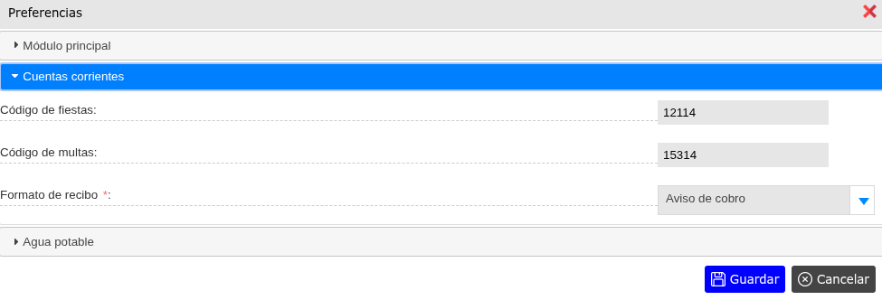
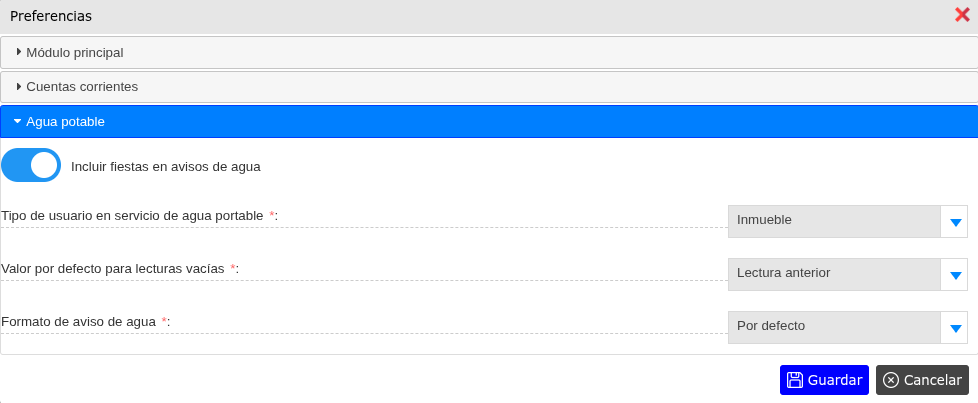

# Preferencias

Las preferencias son configuraciones en el comportamiento de los distintos módulos del sistema para adaptarlo a las propias necesidades de cada distrito.

---

Para ver las preferencias, vaya a: **Configuraciones > Preferencias**.

---

