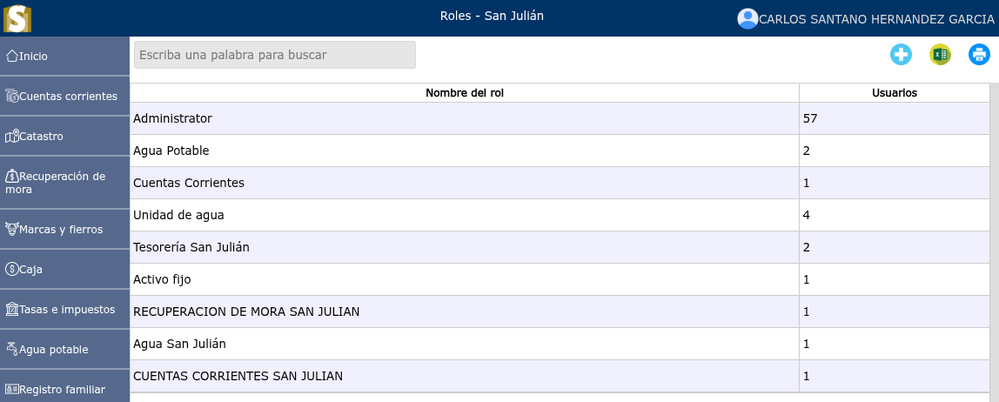
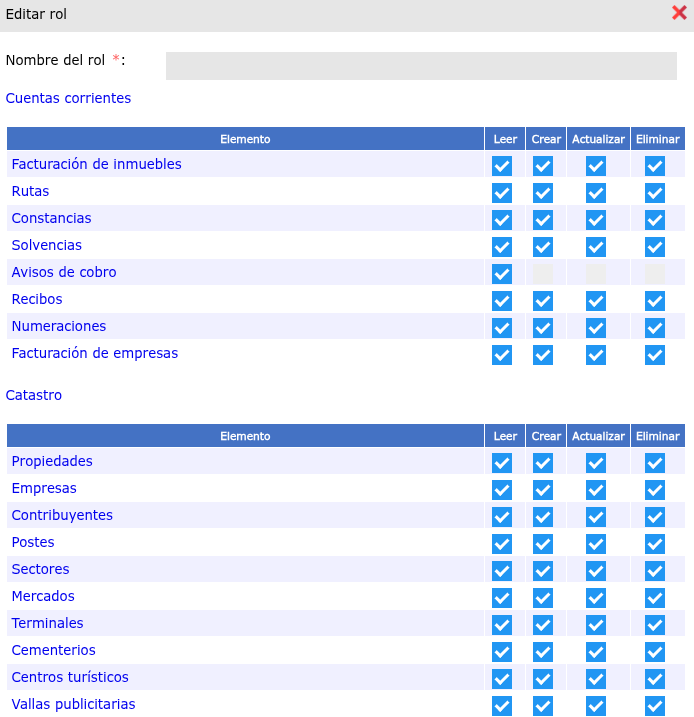
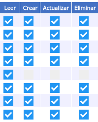

# Roles

Los roles permiten controlar el acceso específico a distintos elementos del sistema.

---

## Lista de roles

Para ver la lista de roles, vaya a: **Configuraciones > Roles.**

---

## Crear un rol

Por defecto, el sistema tendrá creado un rol que estará asignado al administrador del sistema. Sin embargo, puede crear diferentes roles con la configuración de permisos que desee.

Para crear un nuevo rol, vaya a: **Configuraciones > Roles**, y luego dar clic en el botón **+**.

---

## Elementos y permisos

Los permisos que encontrará disponibles para cada elemento son: **_leer, crear, actualizar y eliminar._**

