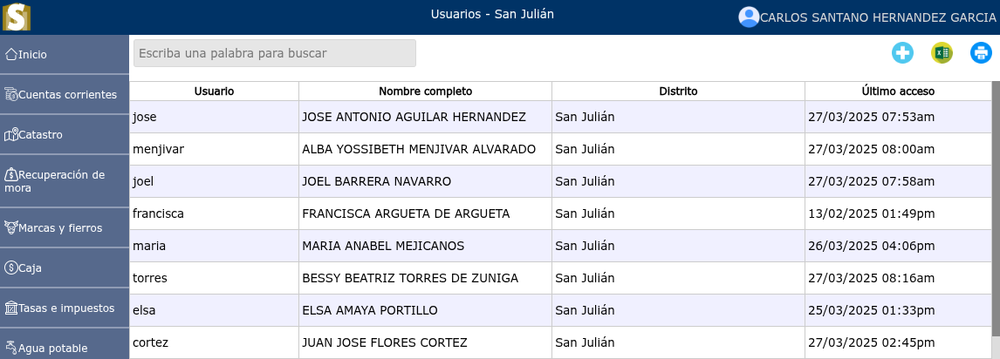
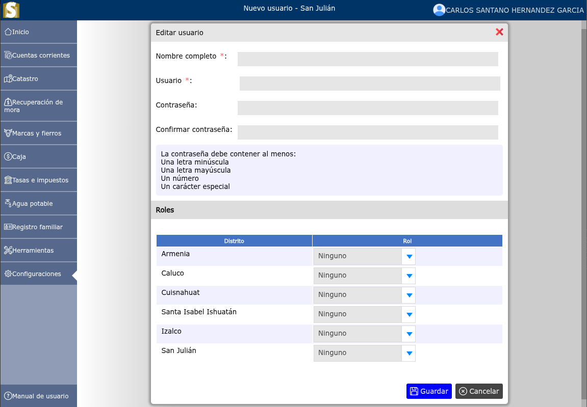
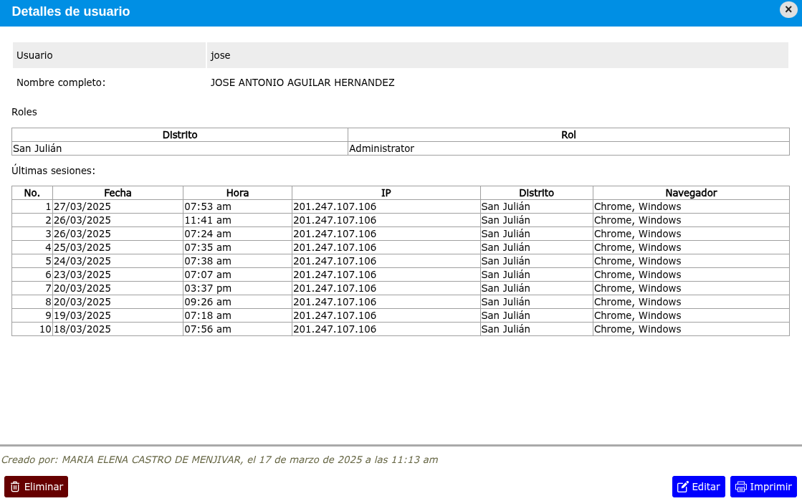

# Usuarios

Los usuarios son cada una de las personas con credenciales de acceso **(usuario y contraseña)** y determinado número de permisos en el sistema.

---

## Lista de usuarios

Para ver la lista de usuarios, vaya a: **Configuraciones > Usuarios**.

---

## Crear un usuario

Para crear un usuario, vaya a: **Configuraciones > Usuarios**, luego dar clic en el botón **+**.

---

## Modificar usuario

Para modificar un usuario, vaya a: **Configuraciones > Usuarios**, luego dar clic en el nombre de el usuario que desea modificar y se mostrará una vista en donde podrá observar la opción **Editar**.

---

## Eliminar usuario

Para eliminar un usuario, vaya a: **Configuraciones > Usuarios**, luego dar clic en el nombre de el usuario que desea eliminar y se mostrará una vista en donde podrá observar la opción **Eliminar**.

