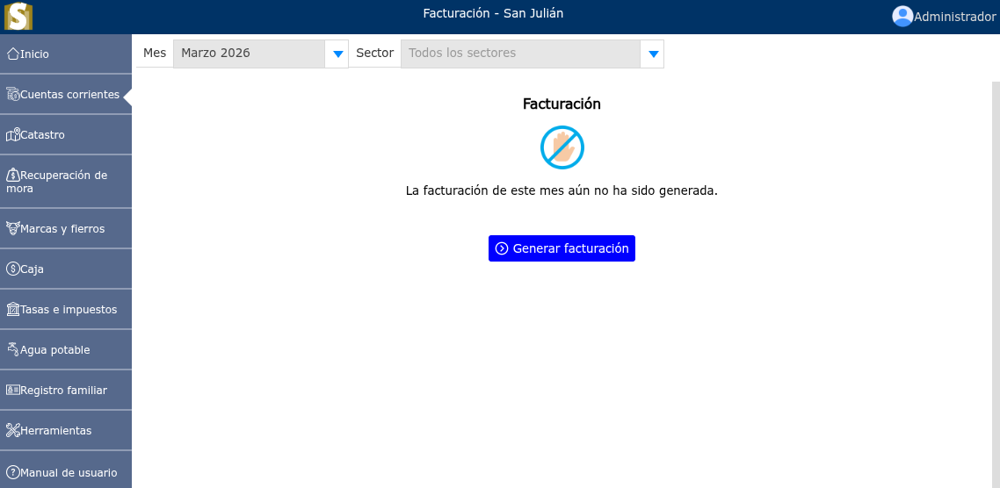
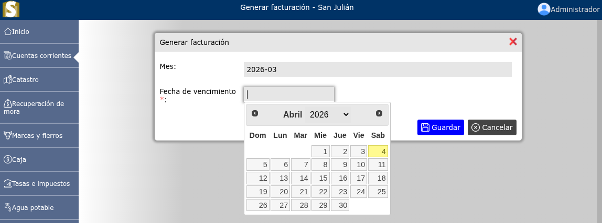
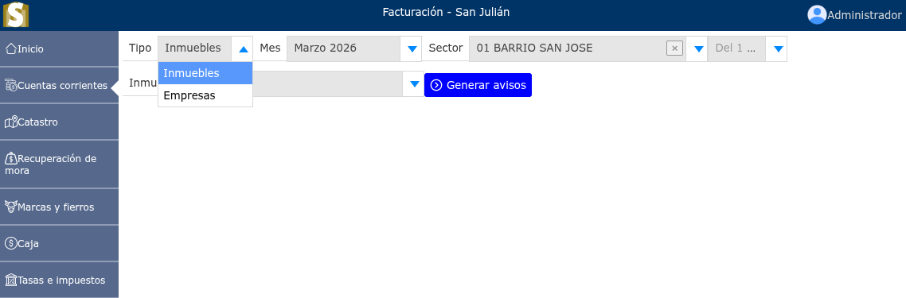

# Avisos de cobro

Lista de avisos generados.

---

## **Ingreso a avisos de cobro**

Para ingresar a los avisos de cobro, vaya a: **Cuentas corrientes > Avisos de cobro**. Si el mes en facturación ha sido generado, se mostrarán los avisos, de lo contrario se mostrará un mensaje que lo guiará a crear un nuevo mes de facturación.

---

## **Generación de avisos de cobro**

Para realizar la generación de avisos de cobro, vaya a: **Cuentas corrientes > Avisos de cobro**, luego dar clic en la opción de **Generar facturación**, y se mostrará un formulario en donde deberá seleccionar la fecha de vencimiento de el mes en facturación.

Luego se mostrará un formulario en donde podrá seleccionar el tipo de generación ya sea por inmuebles o empresas, luego ir seleccionando y generando cada uno de los sectores.

