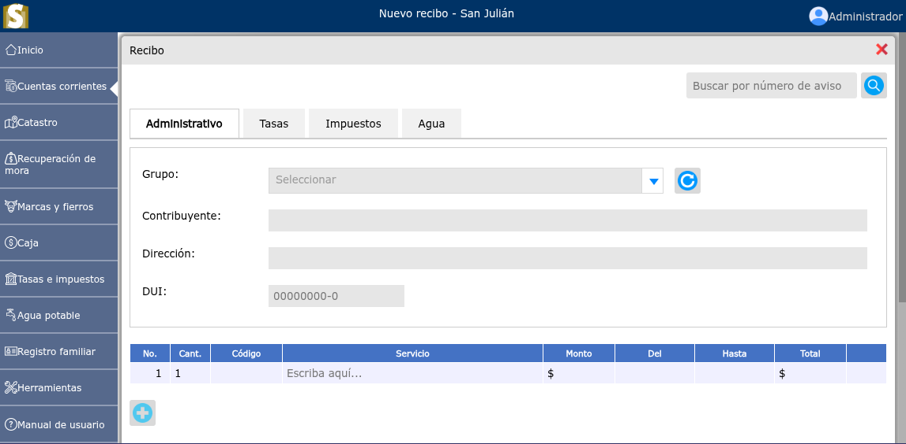
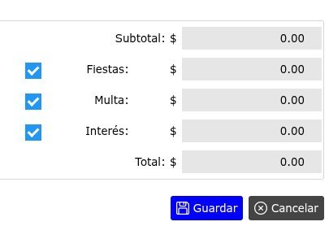
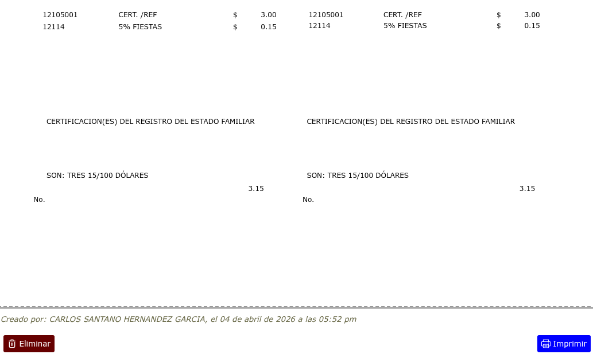
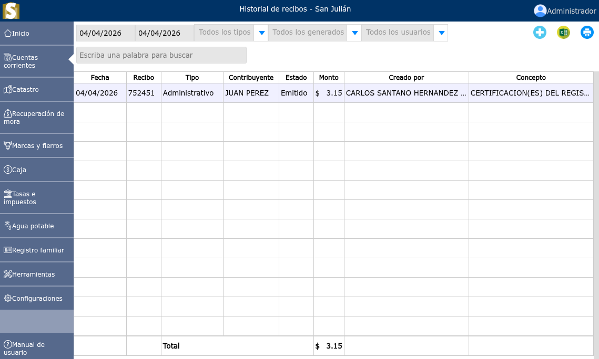
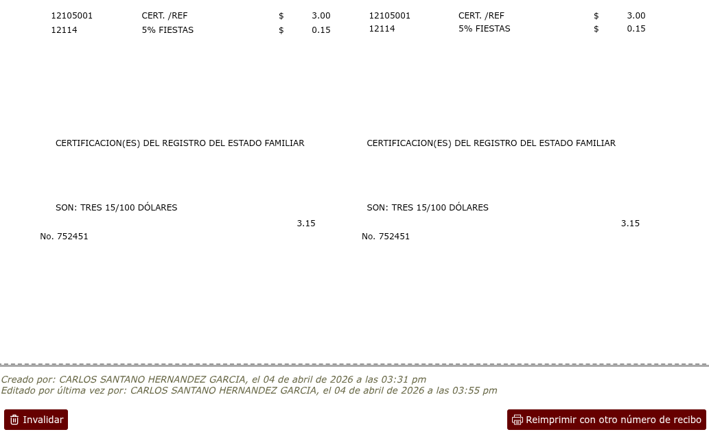

# Recibos

Creación, impresión y control de recibos de tasas e impuestos.

---

## Generación de un recibo

Para generar un recibo, vaya a: **Cuentas corrientes > Nuevo recibo**.

---

### Activación y desactivación de fiestas, multas e íntereses

Para activar o desactivar fiestas, multas o íntereses dar clic en la casilla de verificación junto al ítem correspondiente.

---

### Impresión de un recibo

Para imprimir un recibo luego de que se ha hecho el proceso de generación se mostrará una vista en donde se podrá observar la opción **Imprimir**. Al momento de dar clic en la opción **Imprimir** se genera el correlativo.

---

## Historial de recibos

Para ingresar al historial de recibos, vaya a: **Cuentas corrientes > Historial de recibos**, en donde podrá observar las opciones de filtrar todos los tipos de recibos por fechas, todos los generados ya sea emitidos, pagados o anulados y filtrar cuales recibos fueron generados por cada uno de los usuarios.

---

### Invalidar un recibo

Para invalidar un recibo, vaya a: **Cuentas corrientes > Historial de recibos**, luego dar clic en el recibo que desea invalidar y se podrá observar la opción **Invalidar**.

---

### Reimprimir con otro número de recibo

Para reimprimir con otro número de recibo, vaya a: **Cuentas corrientes > Historial de recibos**, luego dar clic en el recibo que desea reimprimir con un nuevo correlativo y se podrá observar la opción **Reimprimir con otro número de recibo**.

