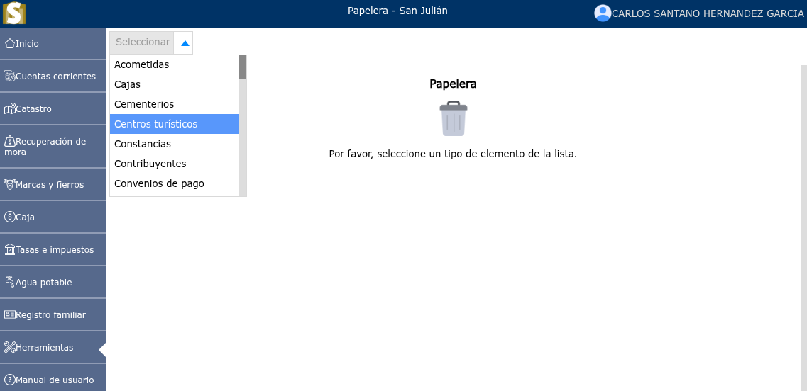
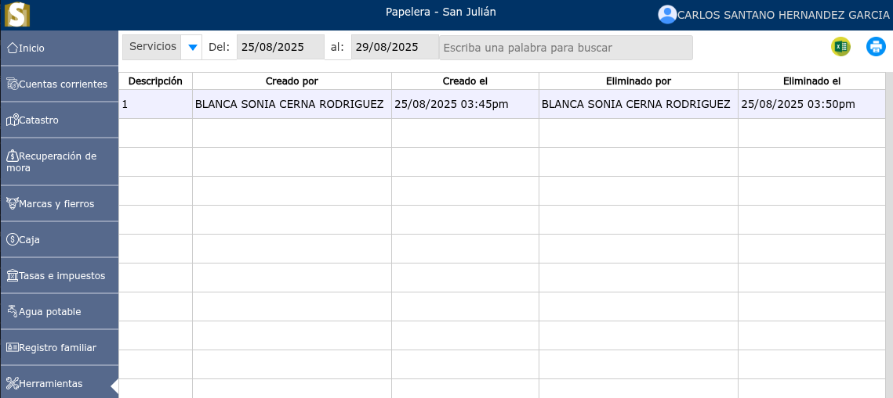

# Papelera de reciclaje

La papelera de reciclaje es un área de almacenamiento temporal que guarda elementos borrados antes de su eliminación definitiva.

---

## Papelera

Para ver la lista de elementos eliminados, vaya a: **Herramientas > Papelera**.

Se mostrará un selector en donde podrá seleccionar cada uno de los elementos y filtrarlos por fechas.

Por ejemplo: eliminación de usuarios, servicios, recibos, numeraciones, ordenanzas, etc.

