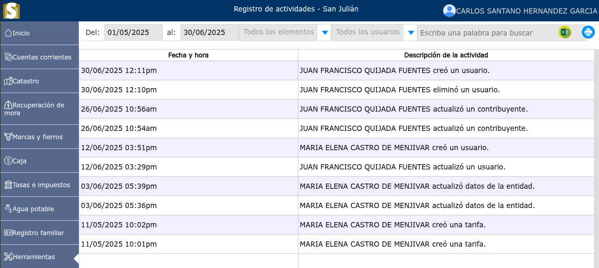

# Registro de actividades

Cada una de las actividades que modifican información (creación, modificación y eliminación de registros), forman parte del registro de actividades del sistema.

---

## Historial de actividades

Para ver el historial de actividades, vaya a **Herramientas > Registro de actividades**.

Se mostrará un selector en donde podrá seleccionar por fechas, elementos y actividades de cada uno de los usuarios.

