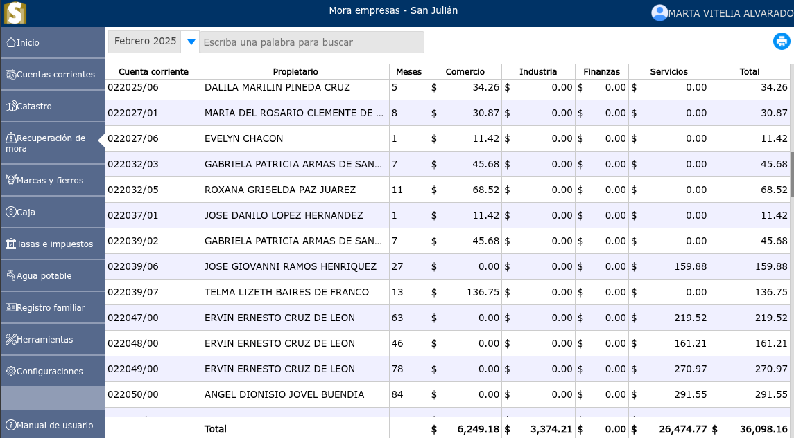

# Mora empresas

Es un sobrecargo que se aplica a dicha empresa por no haber cancelado el impuesto en el periodo establecido.

---

## Lista de mora empresas

Para ver la lista de mora empresas, vaya a: **Recuperación de mora > Mora empresas**. En donde se mostrará un selector en el cual podrá filtrar la mora de empresas por mes.

