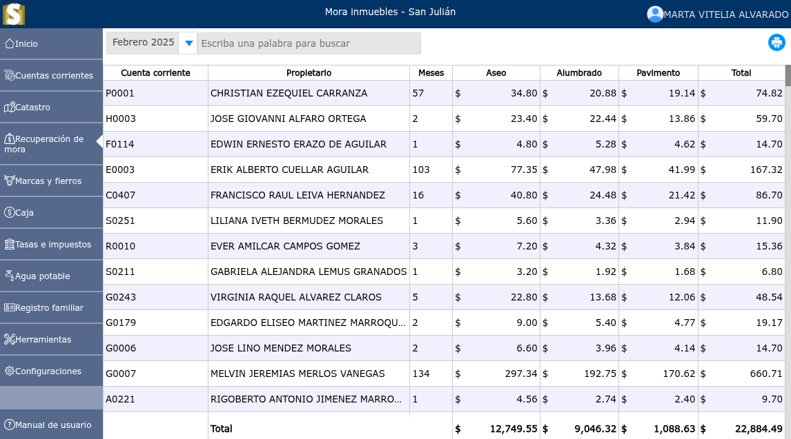

# Mora inmuebles

Es un sobrecargo que se aplica a dicho inmueble por no haber cancelado el impuesto en el periodo establecido.

---

## Lista de mora inmuebles

Para ver la lista de mora inmuebles, vaya a: **Recuperación de mora > Mora inmuebles**. En donde se mostrará un selector en el cual podrá filtrar la mora de inmuebles por mes.

