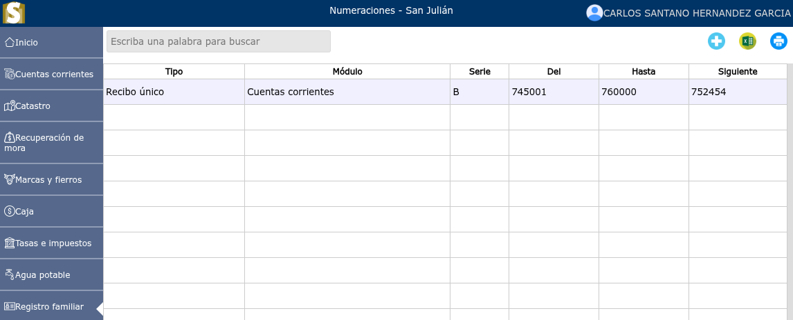
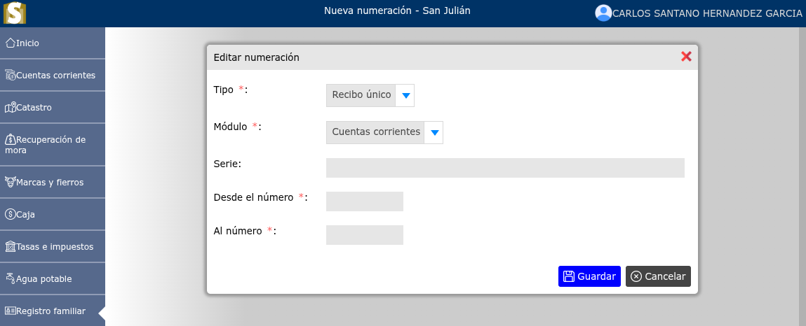
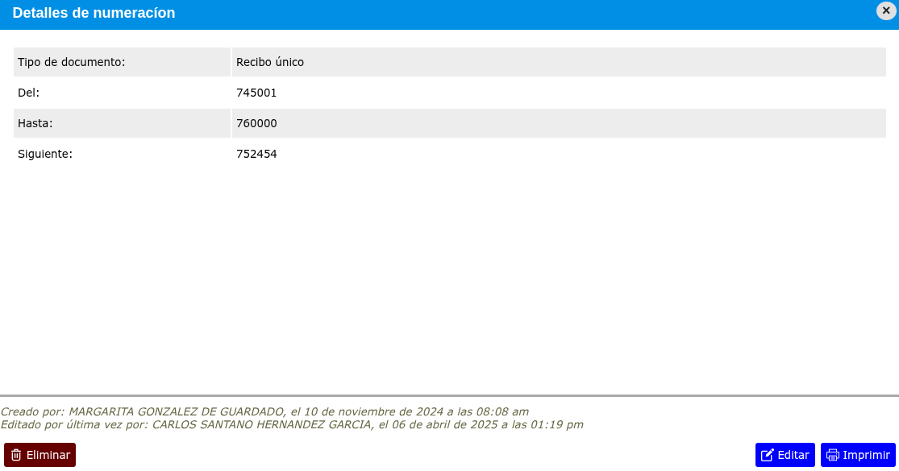

# Numeraciones

Las numeraciones son el registro que permiten controlar de forma consecutiva la emisión de documentos legales y comerciales dentro del sistema.

---

## Lista de numeraciones

Para ver la lista de numeraciones, vaya a: **Registro familiar > Numeraciones**.

---

## Registrar nueva numeración

Para registrar una nueva numeración, vaya a: **Registro familiar > Numeraciones**, y luego dar clic en el botón **+**.

---

## Editar numeración

Para editar una numeración, vaya a: **Registro familiar > Numeraciones**, luego dar clic en el nombre de la numeración que desea editar y se mostrará una vista en donde podrá observar la opción **Editar**.

---

## Eliminar numeración

Para eliminar una numeración, vaya a: **Registro familiar > Numeraciones**, luego dar clic en el nombre de la numeración que desea eliminar y se mostrará una vista en donde podrá observar la opción **Eliminar**.

