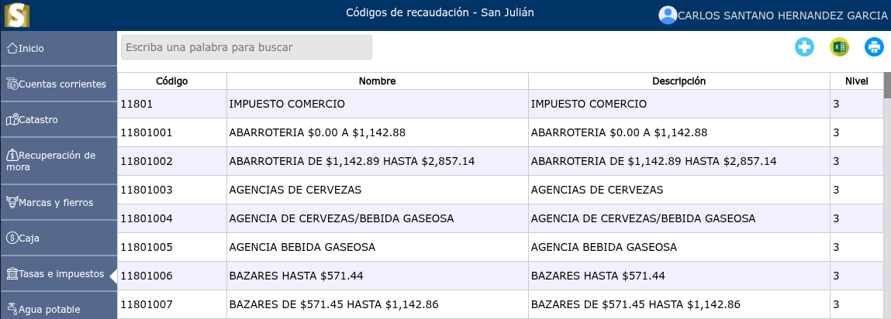
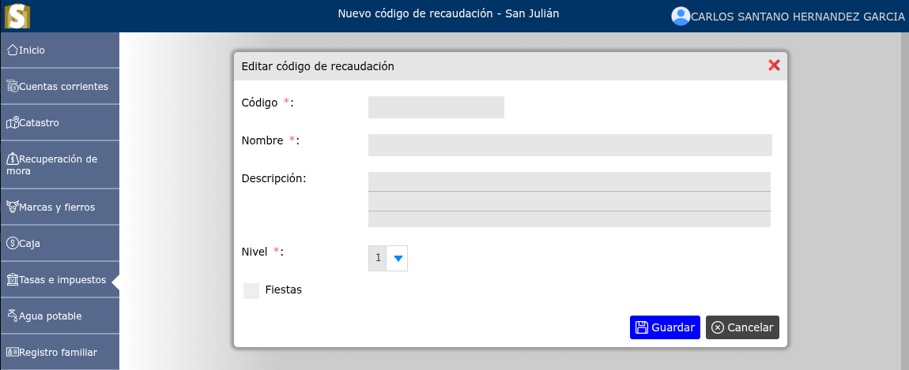
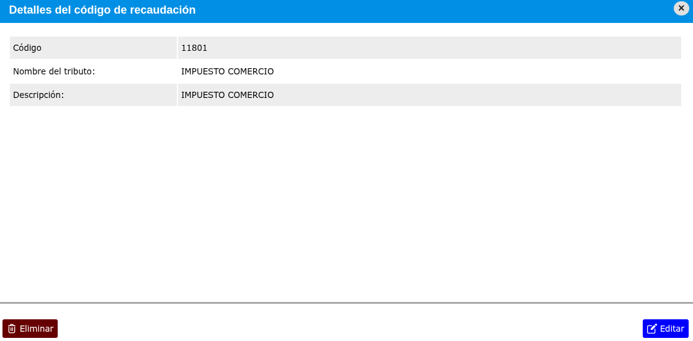

# Códigos de recaudación

Lista de códigos de recaudación.

---

## Lista de códigos de recaudación

Para ver la lista de códigos de recaudación, vaya a: **Tasas e impuestos > Códigos de recaudación**.

---

## Registro de nuevo código de recaudación

Para registrar un nuevo código de recaudación, vaya a: **Tasas e impuestos > Códigos de recaudación**, y luego dar clic en el botón **+**.

---

## Modificación de código de recaudación

Para modificar un código de recaudación, vaya a: **Tasas e impuestos > Códigos de recaudación**, luego dar clic en el nombre de el código de recaudación que desea modificar y se mostrará una vista en donde podrá observar la opción **Editar**.

---

## Eliminar código de recaudación

Para eliminar un código de recaudación, vaya a: **Tasas e impuestos > Códigos de recaudación**, luego dar clic en el nombre de el código de recaudación que desea eliminar y se mostrará una vista en donde podrá observar la opción **Eliminar**.

