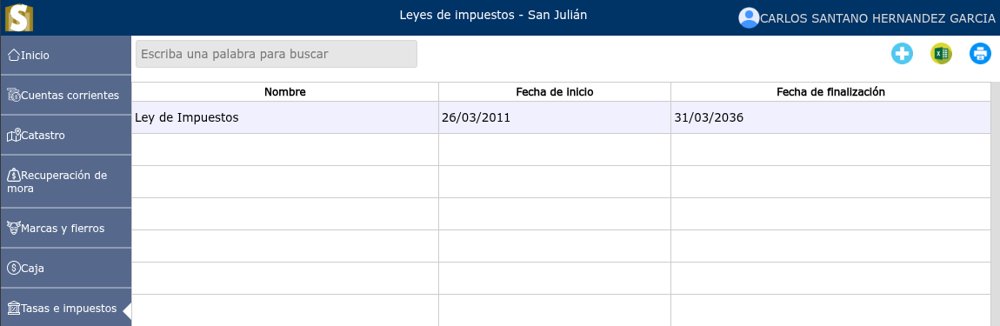
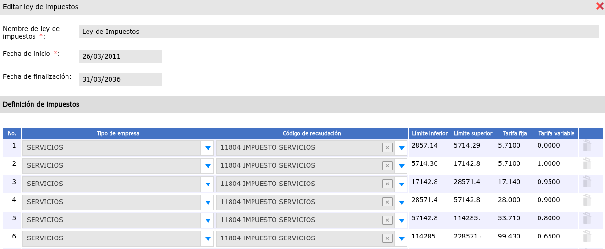
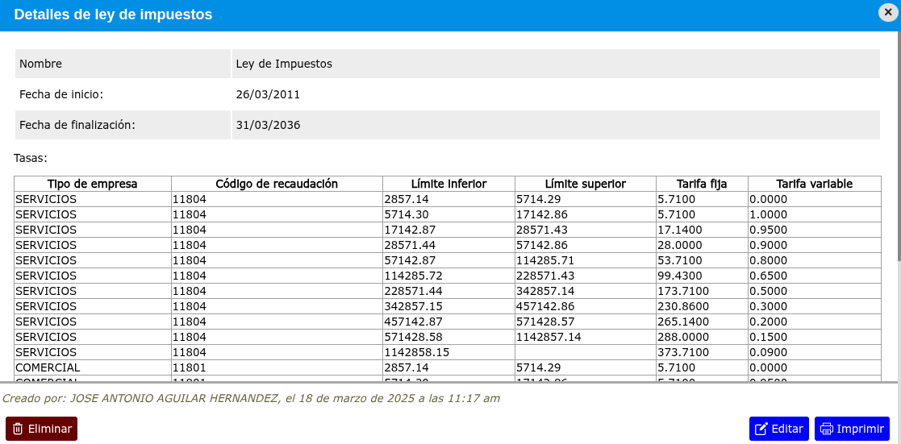

# Leyes de impuestos

Las leyes tributarias son las reglas y los procedimientos legales que rigen la forma en que el Gobierno federal y los Gobiernos estatales y locales calculan los impuestos.

---

## Lista de leyes de impuestos

Para ver la lista de leyes de impuestos, vaya a: **Tasas e impuestos > Leyes de impuestos**.

---

## Registrar nueva ley de impuesto

Para registrar una nueva ley de impuesto, vaya a: **Tasas e impuestos > Leyes de impuestos**, y luego dar clic en el botón **+**.

---

## Modificar ley de impuesto

Para modificar una ley de impuesto, vaya a: **Tasas e impuestos > Leyes de impuestos**, luego dar clic en el nombre de la ley de impuesto que desea modificar y se mostrará una vista en donde podrá observar la opción **Editar**.

---

## Eliminar ley de impuesto

Para eliminar una ley de impuesto, vaya a: **Tasas e impuestos > Leyes de impuestos**, luego dar clic en el nombre de la ley de impuesto que desea eliminar y se mostrará una vista en donde podrá observar la opción **Eliminar**.

