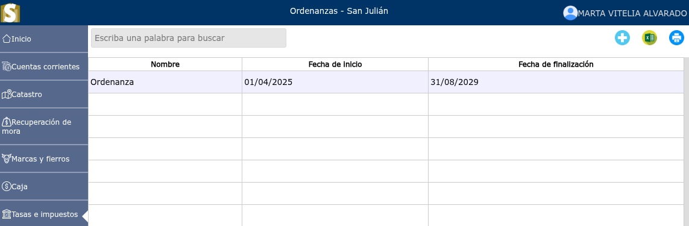
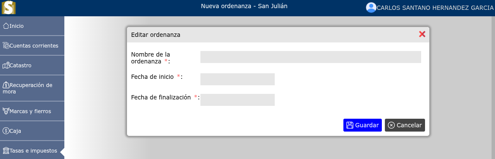
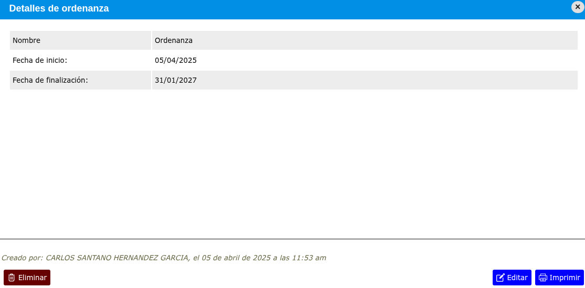

# Ordenanzas de exención

Las ordenanzas de exención municipales son normativas transitorias aprobadas por los Consejos Municipales para dispensar intereses moratorios y multas sobre deudas de tasas e impuestos locales.

---

## Lista de ordenanzas de exención

Para ver la lista de ordenanzas de exención, vaya a: **Tasas e impuestos > Ordenanzas de exención**.

---

## Registrar ordenanza de exención

Para registrar una nueva ordenanza de exención, vaya a: **Tasas e impuestos > Ordenanza de exención**, y luego dar clic en el botón **+**.

---

## Modificar ordenanza de exención

Para modificar una ordenanza de exención, vaya a: **Tasas e impuestos > Ordenanzas de exención**, luego dar clic en el nombre de la ordenanza de exención que desea modificar y se mostrará una vista en donde podrá observar la opción **Editar**.

---

## Eliminar ordenanza de exención

Para eliminar una ordenanza de exención, vaya a: **Tasas e impuestos > Ordenanzas de exención**, luego dar clic en el nombre de la ordenanza de exención que desea eliminar y se mostrará una vista en donde podrá observar la opción **Eliminar**.

