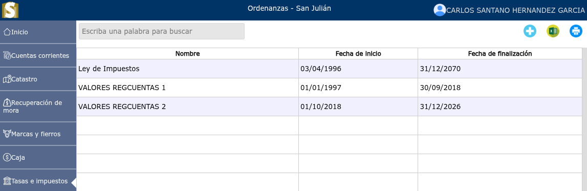
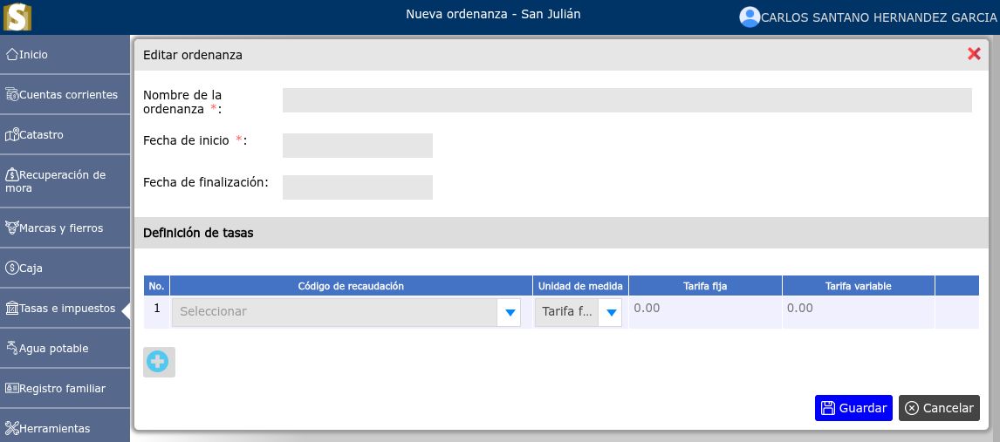
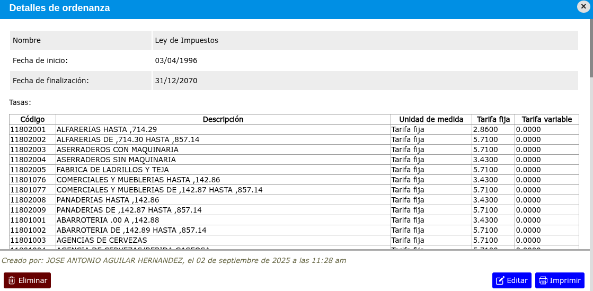

# Ordenanzas

Las ordenanzas municipales son normas jurídicas de carácter general y obligatorio dictadas por el Consejo Municipal para regular materias de interés local dentro de su jurisdicción.

---

## Lista de ordenanzas

Para ver la lista de ordenanzas, vaya a: **Tasas e impuestos > Ordenanzas**.

---

## Registro de nueva ordenanza

Para registrar una nueva ordenanza, vaya a: **Tasas e impuestos > Ordenanza**, y luego dar clic en el botón **+**.

---

## Modificar ordenanza

Para modificar una ordenanza, vaya a: **Tasas e impuestos > Ordenanza**, luego dar clic en el nombre de la ordenanza que desea modificar y se mostrará una vista en donde podrá observar la opción **Editar**.

---

## Eliminar ordenanza

Para eliminar una ordenanza, vaya a: **Tasas e impuestos > Ordenanza**, luego dar clic en el nombre de la ordenanza que desea eliminar y se mostrará una vista en donde podrá observar la opción **Eliminar**.

