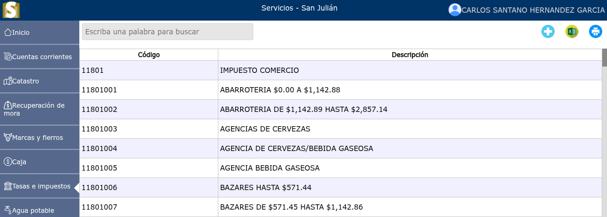
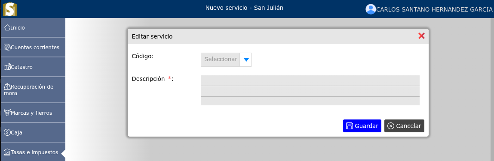
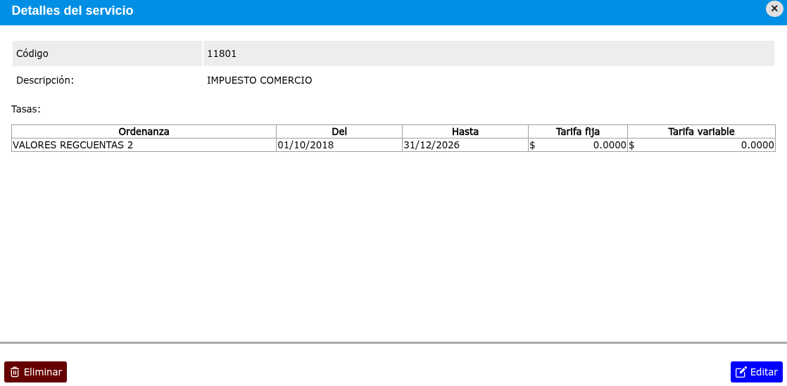
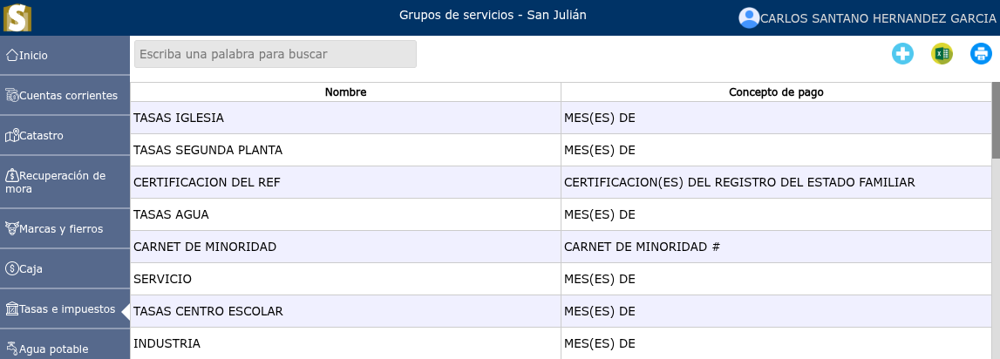
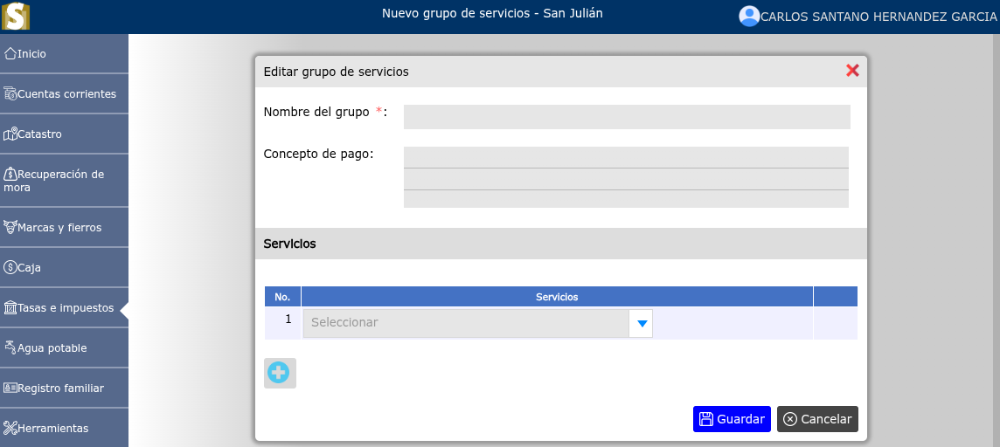
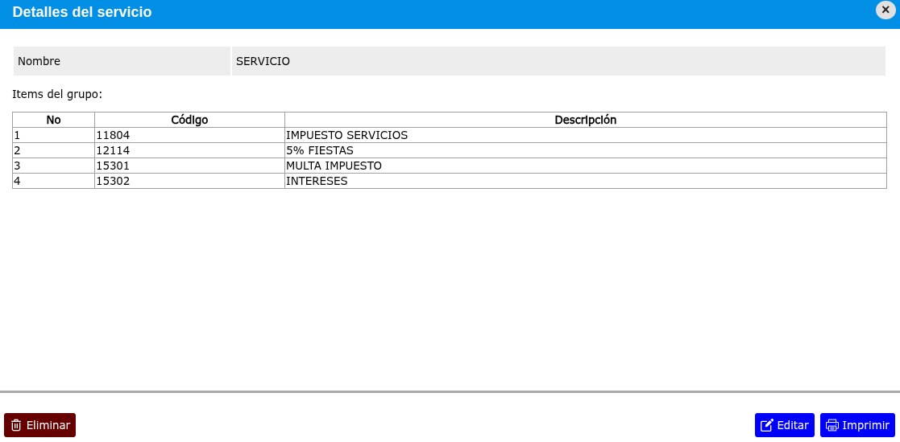

# Servicios

Lista de servicios registrados.

---

## Lista de servicios

Para ver la lista de servicios, vaya a: **Tasas e impuestos > Servicios**.

---

### Registro de nuevo servicio

Para registrar un nuevo servicio, vaya a: **Tasas e impuestos > Servicios**, y luego dar clic en el botón **+**.

---

### Modificación de un servicio

Para modificar un servicio, vaya a: **Tasas e impuestos > Servicios**, luego dar clic en el nombre de el servicio que desea modificar y se mostrará una vista en donde podrá observar la opción **Editar**.

---

### Eliminar un servicio

Para eliminar un servicio, vaya a: **Tasas e impuestos > Servicios**, luego dar clic en el nombre de el servicio que desea eliminar y se mostrará una vista en donde podrá observar la opción **Eliminar**.

---

## Grupos de servicios

Para ver los grupos de servicios, vaya a: **Tasas e impuestos > Grupos de servicios**.

---

### Registro de nuevo grupo de servicios

Para registrar un nuevo grupo de servicios, vaya a: **Tasas e impuestos > Grupos de servicios**, y luego dar clic en el botón **+**.

---

### Modificación de un nuevo grupo de servicios

Para modificar un grupo de servicios, vaya a: **Tasas e impuestos > Grupos de servicios**, luego dar clic en el nombre de el grupo de servicios que desea modificar y se mostrará una vista en donde podrá observar la opción **Editar**.

---

### Eliminar grupo de servicios

Para eliminar un grupo de servicios, vaya a: **Tasas e impuestos > Grupos de servicios**, luego dar clic en el nombre de el grupo de servicios que desea eliminar y se mostrará una vista en donde podrá observar la opción **Eliminar**.

