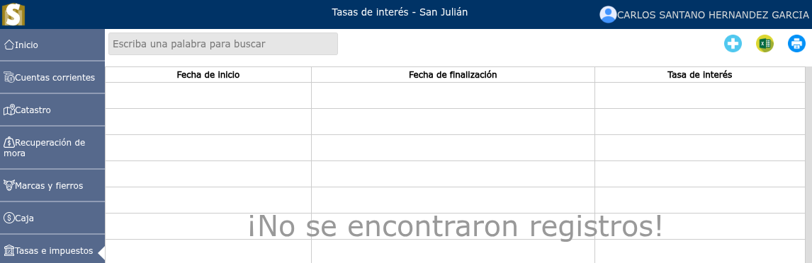
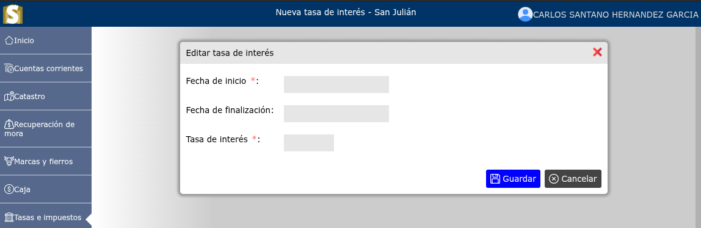

# Tasas de interés

Las tasas de interés suelen aplicarse a intereses moratorios sobre tasas municipales no pagadas.

---

## Lista de tasas de interés

Para ver la lista de tasas de interés, vaya a: **Tasas e impuestos > Tasas de interés**.

---

## Registro de nueva tasa de interés

Para registrar una nueva tasa de interés, vaya a: **Tasas e impuestos > Tasas de interés**, y luego dar clic en el botón **+**.

